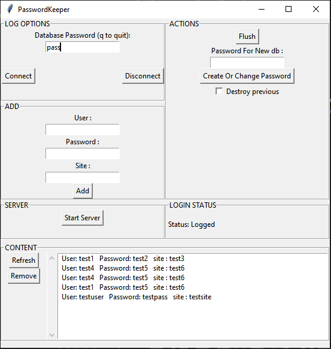
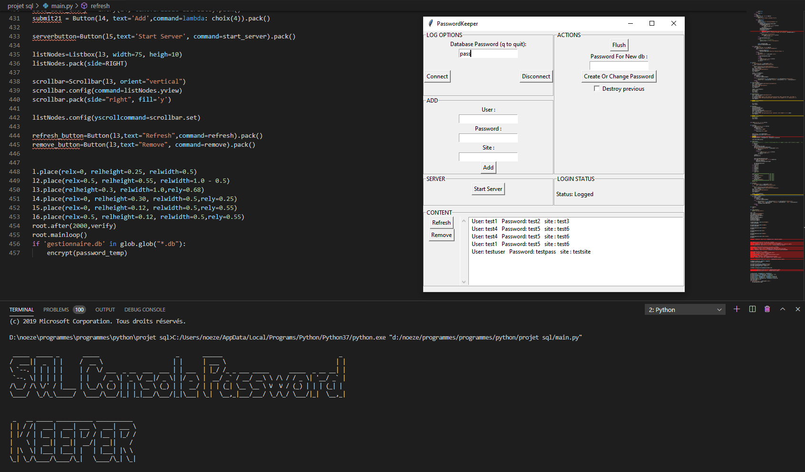

## Password Keeper
> To keep your passwords :)

Password Keeper is a password keeper that use encryption to prevent stealing.




## Installation

Windows:

```sh
pip install pycryptodome
pip install pysqlite3
pip install cryptography
```

## Usage example

To store your passwords, user, and site with encryption methods.


## Release History
* 0.2.2
    * Working On Web-Server
    * CHANGE: Patched app crashs when Password Incorrect
    * ADD: Tkinter Graphic Interface
* 0.2.1
    * ADD: Console Graphics in main.py
* 0.2.0
    * ADD: Cookies
    * CHANGE: Patched db overwriting
    * ADD: Added var.txt
* 0.1.1
    * ADD: Added hash_lib.py
* 0.1.0
    * ADD: Added fernet_custom.py
* 0.0.1
    * Work in progress

## Meta

Ph3nX-Z

[https://github.com/Ph3nX-Z/](https://github.com/dbader/)

## Contributing

1. Fork it (<https://github.com/yourname/yourproject/fork>)
2. Create your feature branch (`git checkout -b feature/fooBar`)
3. Commit your changes (`git commit -am 'Add some fooBar'`)
4. Push to the branch (`git push origin feature/fooBar`)
5. Create a new Pull Request
