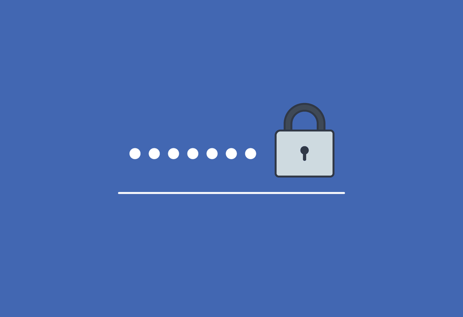
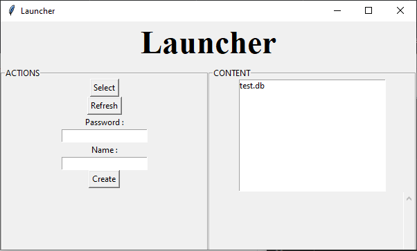
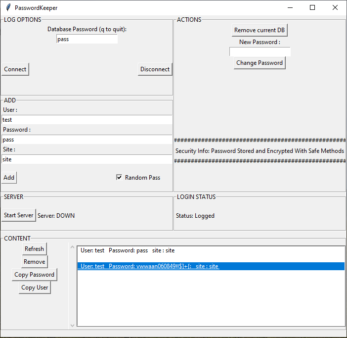
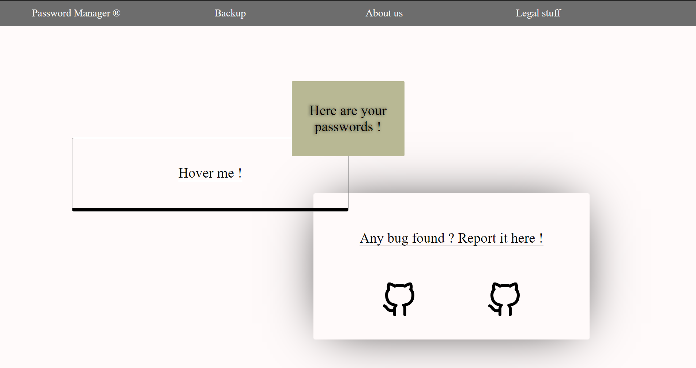

# Password Keeper
To keep your passwords




## Presentation

Password Keeper is a password keeper that use encryption to prevent stealing.

## Usage

### Linux :

#### Install
```sh
Download the repo
python3 launcher.py
```
or
```sh
Download a release
sudo ./passwordkeeper (soon)
```
#### Uninstall
```sh
Remove the repo
```
or
```sh
remove the executable
```

### Windows :
```sh
Download the repo
run launcher.py with python3
```
or
```sh
Download a release
run passwordkeeper.exe (soon)
```

## Benchmark

Laptop : 
  * RAM      : 16Go
  * PROC     : i5
  * GRAPHICS : GTX 1050Ti

Time : 
* Encryption : 30 sec
* Decryption : 30 sec


### Features

|  Options   | Password Keeper |
|------------|-----------------|
| Encrypted     | Y       |
| The Fastest    | N       |
| Limited | 25 entry in a db       |
| Time      | 30sec       |
| Site Support   | Y       |
|Backup ? | Y |


## Media

### Launcher


### App


### Site


## Project Info
Front-End : [Esteban](https://github.com/Esteban795)

Back-End  : [Ph3nX](https://github.com/Ph3nX-Z)

## Contributing

1. Fork it (<https://github.com/yourname/yourproject/fork>)
2. Create your feature branch (`git checkout -b feature/fooBar`)
3. Commit your changes (`git commit -am 'Add some fooBar'`)
4. Push to the branch (`git push origin feature/fooBar`)
5. Create a new Pull Request
